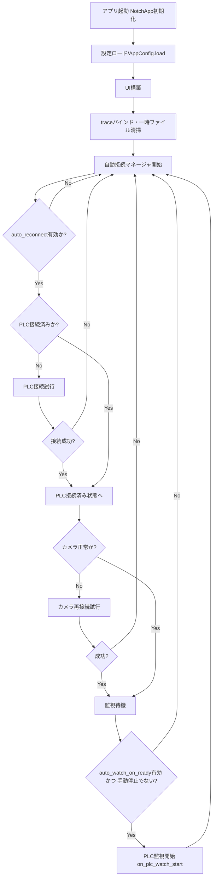
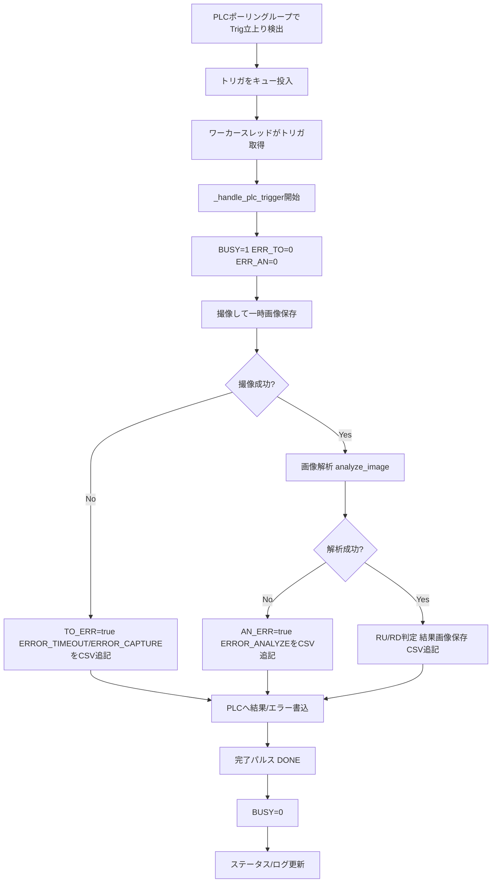
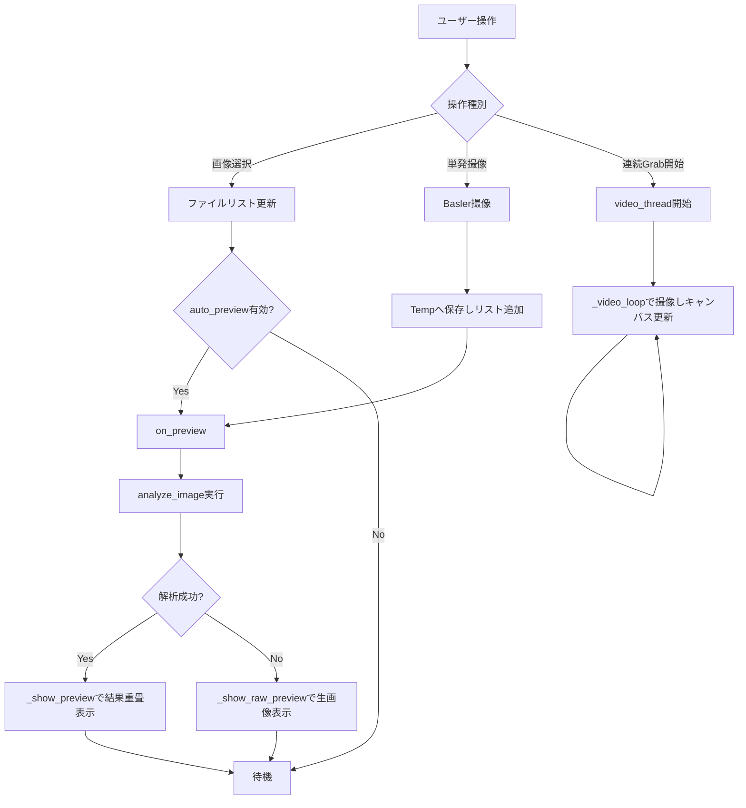
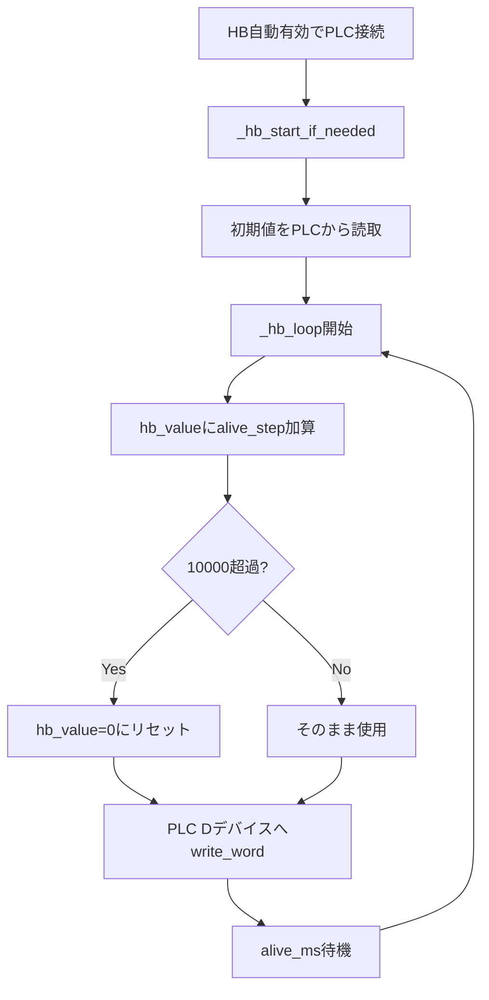

# notch_app 動作フローチャート

この資料は `notch_app.py`（1カメラ版）の主な実行フローを Mermaid で可視化したものです。

## 1. 起動〜自動再接続〜監視開始

## 2. PLCトリガ処理（1トリガあたり）

## 3. 手動操作フロー（画像選択/撮像/プレビュー）

## 4. ハートビート（HB）フロー

---

必要であれば次版として、`notch_app_4cam.py` の「カメラ別トリガ/個別DONE/個別ERR」の詳細フローも別セクションで追加できます。
